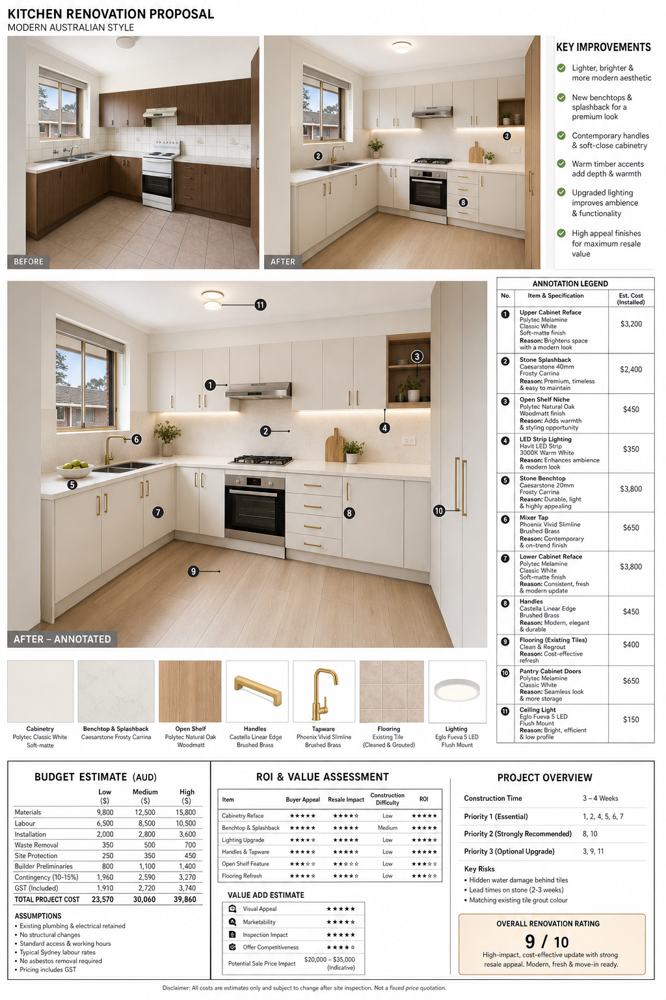

<div align="center">


# astra-makeover

### *A photo in. A renovated listing out. One minute.*


**[English](README.md)  ·  [中文](README_CN.md)**

</div>

<br>

<div align="center">



<sub>*One room photo + a short brief → this entire board, generated as a single image.*</sub>

</div>

<br>

<div align="center">

**Your listing photo looks tired — and buyers scroll past.**
**A designer's render costs hundreds and takes days.**
**You need to show the *potential*, today, before the open home.**

<br>

[**Quick Start**](#-quick-start) · [**What you get**](#-what-you-get) · [**How it works**](#-how-it-works) · [**Use cases**](#-use-cases) · [**Setup**](#-setup)

</div>

<br>

---

## ✨ Why this exists

Showing a buyer what a property *could* become used to mean briefing an interior designer or a
Photoshop artist — hundreds of dollars and a few days per room, then a back-and-forth on
revisions.

With **astra-makeover** you drop a room photo, answer a short design brief, and a minute later
you have a full **renovation analysis board** — the renovated render, a before/after, an
annotated material list, a budget at three levels, and an ROI read — as one clean image you put
straight in front of a client.

It runs inside the agent you already use (Claude Code, Codex, and others), sets itself up with a
single API key, and the boards come out **unbranded** so you present them as your own.

## 🎯 What you get

One image per room, containing:

| Panel | What's on it |
|-------|--------------|
| 🏠 **Photorealistic render** | The same room, renovated in the chosen style — same walls, windows, layout |
| 🔁 **Before / After** | The original photo, for an honest side-by-side |
| 🔖 **Annotated render** | Numbered callouts on each upgrade — material, finish, est. installed cost |
| 🎨 **Material board** | The flooring / stone / cabinetry / tapware / lighting palette |
| 💰 **Budget (Low / Med / High)** | Itemised materials + labour + contingency, GST-inclusive |
| ⭐ **ROI & priorities** | Buyer-appeal stars + a highest-ROI-to-lowest order |
| ✅ **Recommendation** | Strategy, timeline, and an overall score |

> **Minutes, not days. Cents, not hundreds.** The structure stays real — it renovates finishes,
> it never moves your walls or windows.

## ⚡ Quick start

```bash
# 1. one-time: configure your OpenAI API key (guided)
python3 scripts/makeover.py --setup

# 2. generate a board (dry run first — no spend — then add --confirm)
python3 scripts/makeover.py \
  --ref kitchen.jpg \
  --brief Style="Modern Australian" --brief Objective=Resale --brief Budget='$20-40k' \
  --brief Priority="Best Resale" \
  --property "12 King St" --room kitchen --confirm
```

Or just tell your agent: **“makeover this kitchen for resale”** — it runs the guided interview
for you.

## 🔧 How it works

```
  📷 Photos in  →  🔍 Space analysis  →  📝 Design brief  →  🖼️  One board out
```

1. **Photos in** — one room, one or more angles.
2. **Space analysis** — the agent reads the room.
3. **Design brief** — a few quick questions: style, objective, budget, what to keep, priority.
4. **One board out** — generated via OpenAI gpt-image-2, saved to `~/makeover-outputs/<property>/`.

Multiple rooms? Run it per room.

## 🏘️ Use cases

- **Real-estate agent** — turn a dated listing photo into a "renovated potential" board for the
  campaign and the open home.
- **Staging company** — show clients the end result before committing to a physical stage.
- **Flipper / investor** — a fast budget + ROI read on a renovation before you buy.
- **Landlord** — visualise a refresh that lifts rent without touching structure.

## 🛠️ Setup

- **Requirements:** Python 3.9+, `pip install openai`, and an OpenAI API key.
- **Key:** run `--setup` (guided) — it validates the key and stores it locally
  (`~/.config/astra-makeover/config.env`, chmod 600, never committed). Re-check with
  `--check-key`.
- **Cost:** pay-per-image, roughly a few cents per board, billed to your own OpenAI account.

> **Note:** generation always runs through the OpenAI API for top quality. Even in agents with
> their own image generation, this skill uses the API path on purpose — it produces a true,
> high-quality edit of your actual room.

## 📄 License

Astra Source Available License. Free for personal use and learning. Commercial use requires a
separate license. See [LICENSE](LICENSE).

<br>

---

<div align="center">


**Show the potential. Win the listing.**

[](https://astralune.ai)

Built by [**Astralune**](https://astralune.ai) · [github.com/Astralune-ai](https://github.com/Astralune-ai)

</div>
